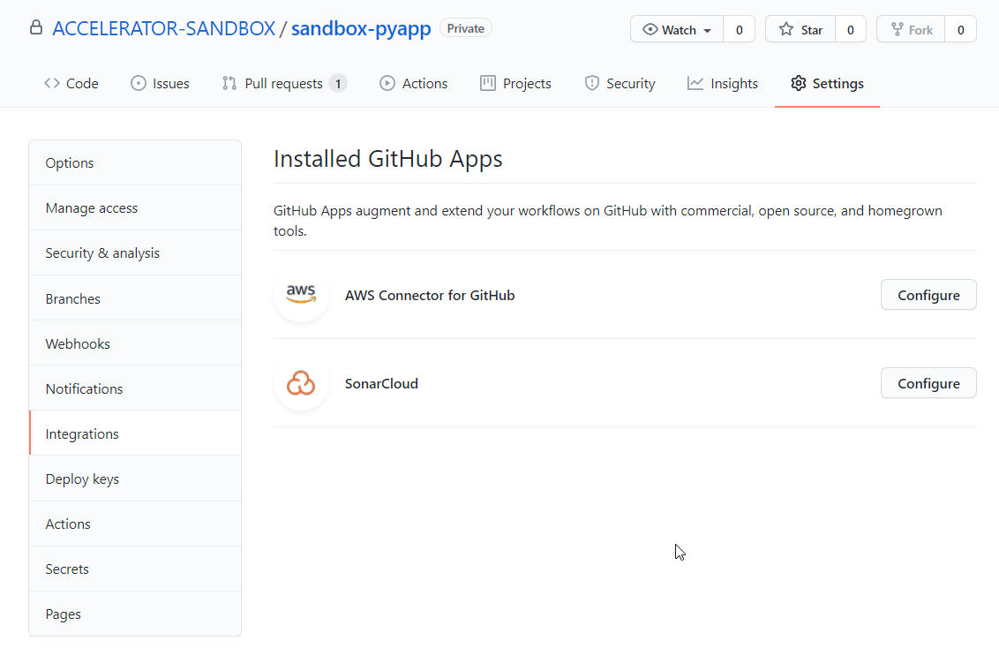
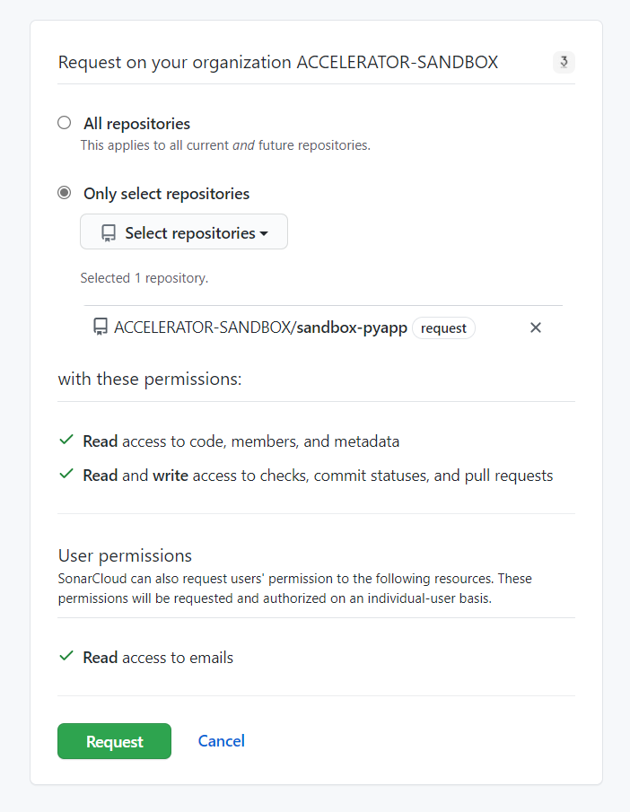
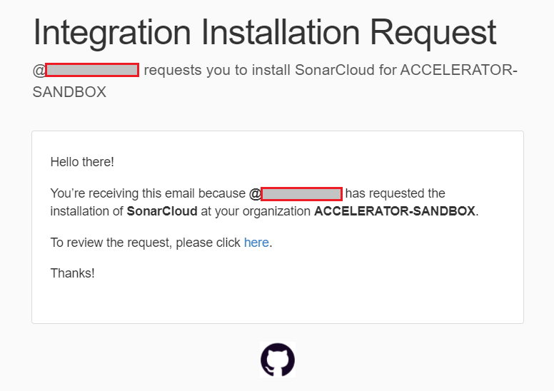
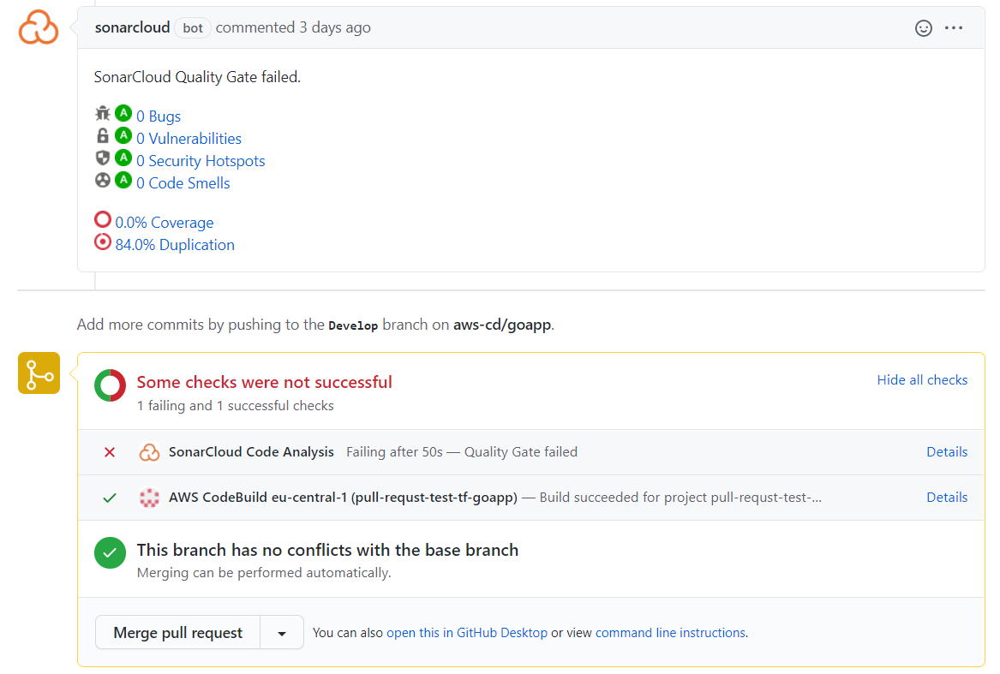
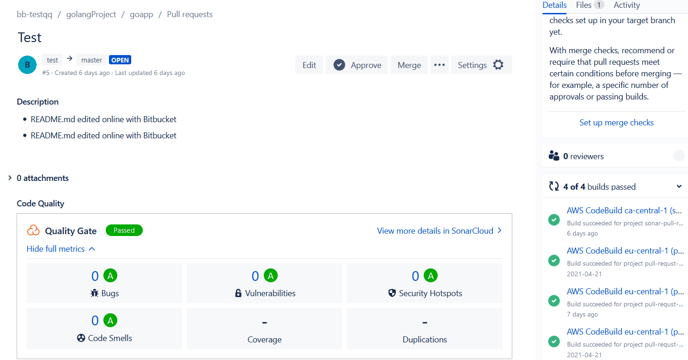
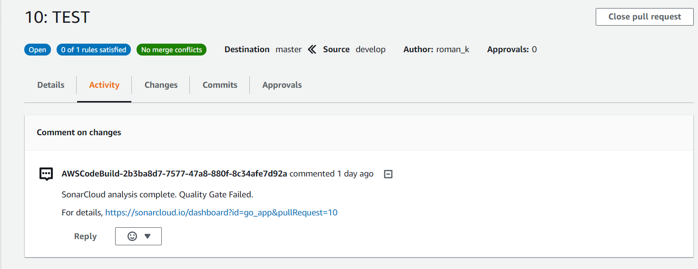

<h1 align="center"> SonarCloud Pull Request Analisis </h1> 

* [GitHub/Bitbucket Pull Requests](./PRanalysis.md#GitHub/bitbucket-Pull-Requests)
* [CodeCommit Pull Requests](./PRanalysis.md#codeCommit-Pull-Requests)
* [GitLab Merge requests](./PRanalysis.md#gitLab-Merge-requests)

<hr>

For now, we support PR analysis with GitHub, Bitbucket and CodeCommit.


## GitHub/Bitbucket Pull Requests 

 

Terragrunt will create a CodeBuild project with the application repository configuration. For this, you need to properly fill in only the parameters corresponding to your project's VCS in the `terragrunt_way/parameter_store.tfvars` file:

for

**Bitbucket**
```
#*********************** For BitBucket **********************4****#
bitbucket_user                = "" # BitBucket technical user
atlantis_bitbucket_user_token = "" # BitBucket technical user token
atlantis_bitbucket_base_url   = "" # BitBucket base URL
```

for

**GitHub**
```
#************************* For Github ***************************#
github_user                   = "" # GitHub technical user
atlantis_github_user_token    = "" # GitHub technical user token
organization_name             = "" # GitHub organization name
```

Please check again that the `terragrunt way/parameter store.tfvars` file is in the `.gitignore` file for the project!!!
See this [quick start guide](../docs/SonarCloud_configuration.md) if you've set up Accelerator from scratch and don't have a SonarCloud organization.
If you're adding a new app to Accelerator, check if it has the SonarCloud app in your Installed GitHub apps.



Otherwise, you need to add SonarCloud permission to install this app. To do this, you can send a request to your organization.



And ask your admin to approve it.



After this step, you need to copy the `buildspec_pr.yml` file with the necessary configuration to the root folder of the application: [buildspec_pr.yml](../docs/template_config_files/buildspec_pr.yml)

The analysis procedure will be launched as soon as a Pull request occurs in the observable repository.

After the analysis you will get a similar output in your pull request window.  
GitHub:  



Bitbucket:  



<hr>

## CodeCommit Pull Requests

 

Terragrunt will create a CodeBuild project with the application repository configuration. Therefore, you do not need to fill in any additional parameters in parameters in the `terragrunt_way/parameter_store.tfvars` file accordingly. 

CloudWatch Event Rule will be created and monitor the CodeCommit repository for `pullRequestCreated` and `pullRequestSourceBranchUpdated`. Once it notices one of the events, it will trigger the CodeBuild in project, which will run SonarCloud analysis according to `buildspec_pr.yml`. [Here](template_config_files/buildspec_pr.yml) is an example of a pull request analysis buildspec file.  

**Additional**: 
You can create an `Approval rule template`, which will deny all attempts of merging `Pull Requests` until **approval** is received. To create it, you need to:
1. Log in to AWS Console
2. Select CodeCommit and choose `Approval rule templates`
3. Click on `Create template` 
4. Give the rule a name (e.g., SonarCloud Pull Request Analysis)
5. Add `Approval pool members` and enter either the CodeBuild execution role (e.g. arn:aws:sts::**AccoutID**:assumed-role/**CodeBuildIAMRoleName**/*) , or the IAM role name of your CodeBuild role (e.g. my_codebuild_approval_role_name)
6. Under `Associated repositories`, find and select the repositories you want to have this approval 

After the analysis, you will get a similar output in your pull request window (Activity):  



## GitLab Merge requests

 

Unlike previous options, GitLab VCS does not natively interact with AWS CodePipeline, so Terragrunt will perform the configuration in GitLab CI in the application repository. To do this, fill in the parameters in the terragrunt_way/parameter_store.tfvars file accordingly:
**GitLab**
```
#************************* For GitLab ***************************#
gitlab_user                   = "" # GitLab technical user
atlantis_gitlab_user_token    = "" # GitLab technical user token
atlantis_gitlab_hostname      = "" # GitLab hostname URL
project_id                    = "" # GitLab project id
```
Please check again that the `terragrunt way/parameter store.tfvars` file is in the `.gitignore` file for the project!!!
After the analysis you will get a similar output in your pull request window.

