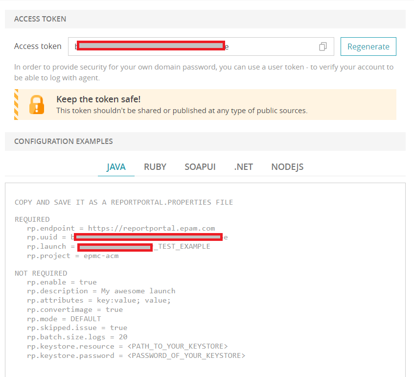
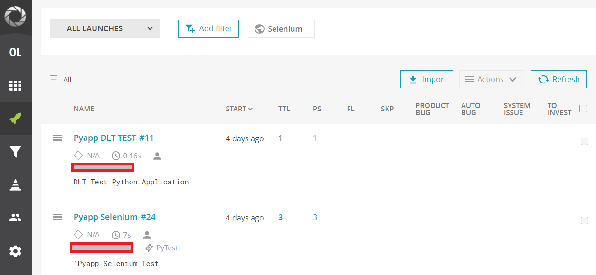

<h1 align="center"> Report Portal </h1>

* [Architecture overview](./Report_Portal.md#architecture-overview)
* [3 easy steps to get started with ReportPortal](./Report_Portal.md#3-easy-steps-to-get-started-with-ReportPortal)
* [Integration with AWS Accelerator](./Report_Portal.md#integration-with-AWS-Accelerator)
* [Integration examples for supported languages](./Report_Portal.md#integration-examples-for-supported-languages)
   * [Java](./Report_Portal.md#java)
   * [Python](./Report_Portal.md#python)
   * [Golang](./Report_Portal.md#golang)
  
<hr>

## Architecture overview

ReportPortal is a service that provides increased capabilities to speed up results analysis and reporting using built-in analytic features.
ReportPortal is a great addition to Continuous Integration and Continuous Testing process.
Report Portal organized into multiple repositories.
Application Core is based on micro-services architecture and includes the following mandatory services: structure


## 3 easy steps to get started with ReportPortal

You can find all the necessary information [here](https://reportportal.io/installation).


##  Integration with AWS Accelerator

You need to access the Report portal and find out the configuration parameters required for connection.
 

Write values for the next three parameters into the file [application_vars.yaml](../terragrunt_way/applications/example_application/application_vars.yml) 
```
#===================================== Report Portal =======================================#
#All 3 parameters must be taken from the ReportPortal.
rp_token_name = "/report/portal/token" # The path for the ReportPortal token in the AWS ParameterStore.
rp_project    = "my_rp_project" # Name of a project in ReportPortal.
rp_endpoint   = "https://reportportal.epam.com" # ReportPortal endpoint URL.
```
Put the value of the token from your Report Portal account into the file [parameter_store.yml](../terragrunt_way/parameter_store_example.yml).
```
#==================== Parameter Store Variables ===================#
rp_token          = "xxxxxxxxxxxxxxxxxxxxxxxxx" # Token for Report Portal.
```
You need to put the file [sonar_report.py](docs/template config_files/scripts/sonar_report.py) into you application's test dirrectoryYou need to place the [sonar_report.py](docs/template config_files/scripts/sonar_report.py) file in your application's test directory in order to connect the Selenium test output to the report portal..
In addition, you will need to enter the necessary variable values [pytest.ini](../docs/template_config_files/scripts/selenium_tests/pytest.ini) in the X file to connect the output of Pytest results and create wrappers in the tests themselves accordingly. You can find some examples in the file [tests.py](../docs/template_config_files/scripts/selenium_tests/tests.py).
For additional options for supported languages, see the following paragraphs.

## Integration examples for supported languages
### Java
* [examples for Java](https://github.com/reportportal/examples-java)
* [client for Java](https://github.com/reportportal/client-java)

### Python
* [client for Python](https://github.com/reportportal/client-Python)

### Golang
* [client for Golang](https://github.com/reportportal/goRP)

After all the modifications to the program, you will see a similar picture in the Report Portal console.

