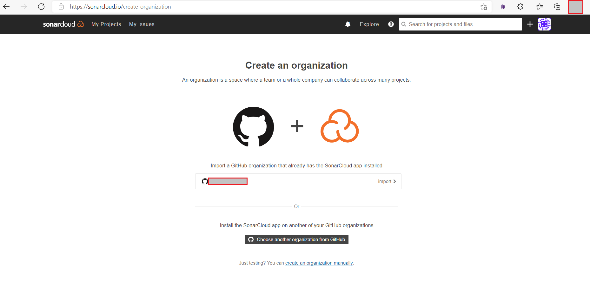
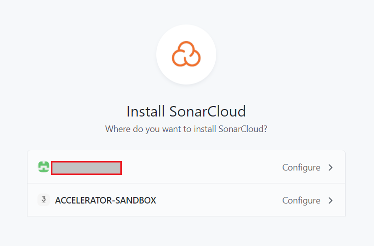
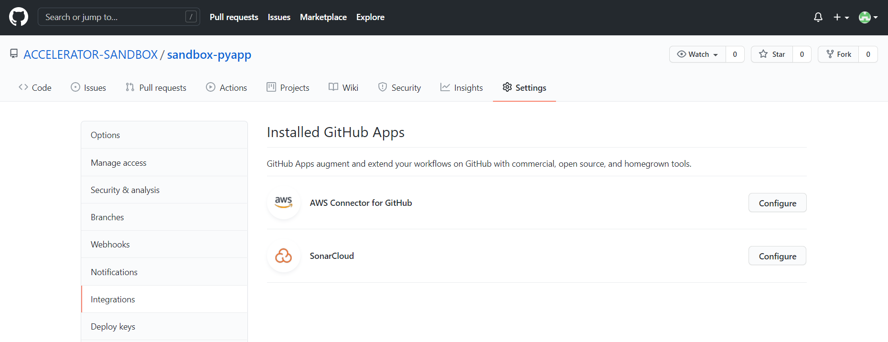
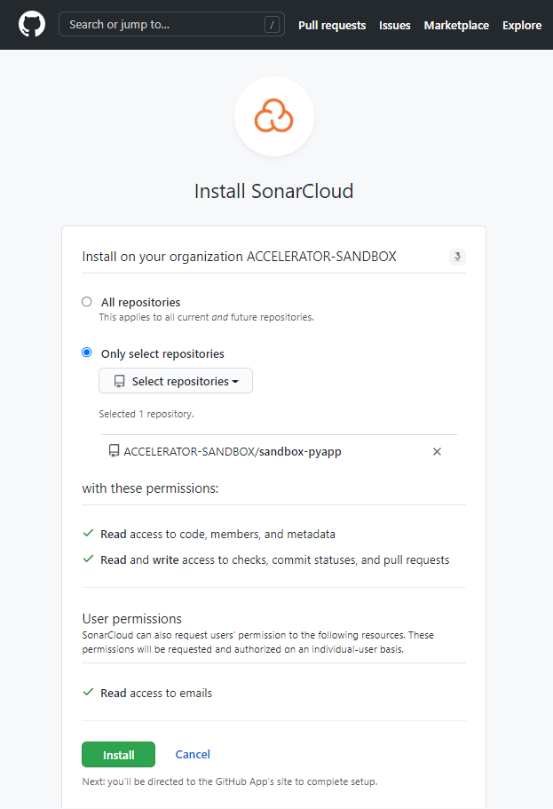
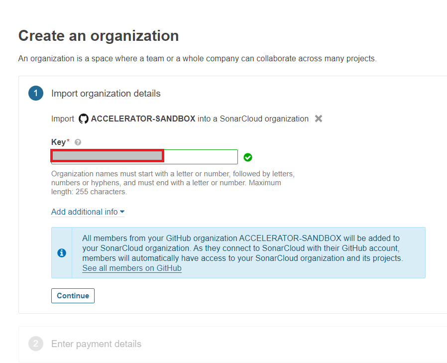
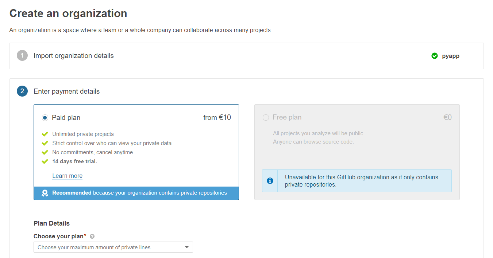
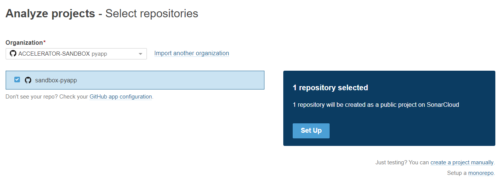
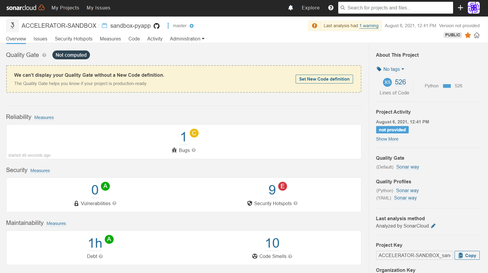

<h1 align="center"> SonarCloud configuration </h1>

To transfer data to `SonarCloud`, some configuration needs to be done on the `SonarCloud` and `VCS` side. First, you must sign in to `SonarCloud` using your `VCS` account and authorize your SonarCloud organization. You can now add the GitHub organization you are using to SonarCloud by clicking the + next to your account.



SonarCloud will be installed as a GitHub App for that organization.



Please check if the SonarCloud app is installed in your organization on GitHub yourself or have the admin check it for you.



Then you need to give SonarCloud access to your repository.



In SonarCloud you can now create an organization.



And choose a plan for this.



Then start to analyze a new project.



If everything is ok, you should be able to see something like this.



For a more complete setup of SonarCloud, refer to the [official documentation](https://sonarcloud.io).

After this step, the file `buildspec_test_func.yml` with the necessary configuration in the application's root folder must be created, e.g., [buildspec_test_func.yml](template_config_files/buildspec_test.yml) 
Terragrunt will create a CodeBuild project with the application repository configuration, for this, you need to properly fill in only the parameters corresponding to your project's VCS in the `terragrunt_way/parameter_store.tfvars` file:

for

**Bitbucket**
```
#*********************** For BitBucket **********************4****#
bitbucket_user                = "" # BitBucket technical user
atlantis_bitbucket_user_token = "" # BitBucket technical user token
atlantis_bitbucket_base_url   = "" # BitBucket base URL
```

for

**GitHub**
```
#************************* For GitHub ***************************#
github_user                   = "" # GitHub technical user
atlantis_github_user_token    = "" # GitHub technical user token
organization_name             = "" # GitHub organization name
```

for

**GitLab**
```
#************************* For GitLab ***************************#
gitlab_user                   = "" # GitLab technical user
atlantis_gitlab_user_token    = "" # GitLab technical user token
atlantis_gitlab_hostname      = "" # GitLab hostname URL
project_id                    = "" # GitLab project id
```

or leave it blank for CodeCommit VCS.

Please check again that the `terragrunt way/parameter store.tfvars` file is in the `.gitignore` file for the project!!!