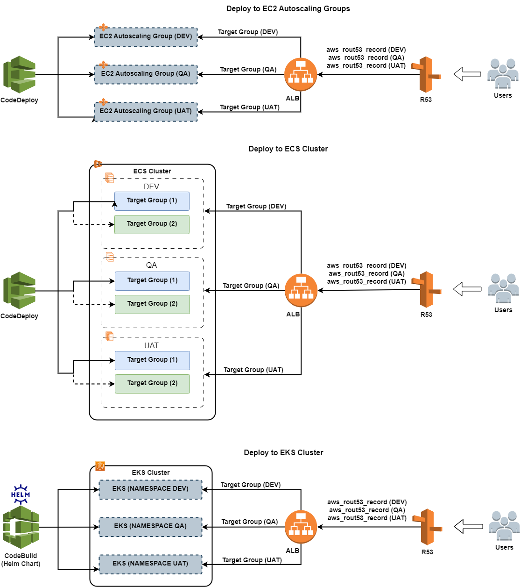

<h1 align="center"> Application environments </h1> 

  * [Deploy to EC2](./app-envs.md#deploy-to-EC2)
  * [Deploy to ECS](./app-envs.md#deploy-to-ECS)
  * [Deploy to EKS](./app-envs.md#deploy-to-EKS)

## Deploy to EC2
`ALB` with `Target Groups` for corresponding environments (`DEV`, `QA`, `UAT`) is created during the `CodePipeline` infrastructure deployment step.

CodeDeploy is responsible for:
* deploy Application to `Autoscaling Groups` with `CodeDeploy agent`
* CodeDeploy updates `applications` in place on EC2 instances.

## Deploy to ECS
`ALB` with `Target Groups` and `ECS Services` for corresponding environments (`DEV`, `QA`, `UAT`) is created during the `CodePipeline` infrastructure deployment step

CodeDeploy is responsible for the following:
* deploy Application to the `ECS Services` in ECS cluster
* CodeDeploy updates task definitions for all environments during application deployment/redeployment

## Deploy to EKS

* Helm Chart is updated from CodeBuild
* Each pipeline's stage has its own `namespace` on the EKS cluster.