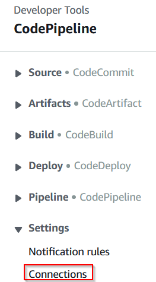

<h1 align="center"> Application Code Hosting platforms </h1> 

The Application can be hosted on these Code Hosting platforms:
* [AWS CodeCommit](./app-vcs.md#codeCommit-and-GitLab)
* [Bitbucket](./app-vcs.md#gitHub-and-Bitbucket)
* [GitHub](./app-vcs.md#gitHub-and-Bitbucket)
* [GitLab](./app-vcs.md#codeCommit-andGitLab)

To configure the application pipeline, copy the configuration file [../terragrunt_way/aplications/exaple_aplication/application_vars.yml](../terragrunt_way/applications/example_application/application_vars.yml) to `terragrunt_way/aplications/<"Aplication">/application_vars.yaml`.
Fill in all the necessary variables, according to the required pipeline configuration.

## GitHub and Bitbucket 

Once the changes have been applied, you have to log into AWS Management Console and select the service "CodePipeline":  

Go into the "Settings" tab, and you will see a pending connection:  

Update this connection, and a new window will pop up where you will need to create a link for your connection with the selected Code Hosting platform.  

## CodeCommit and GitLab 
No additional actions are required.