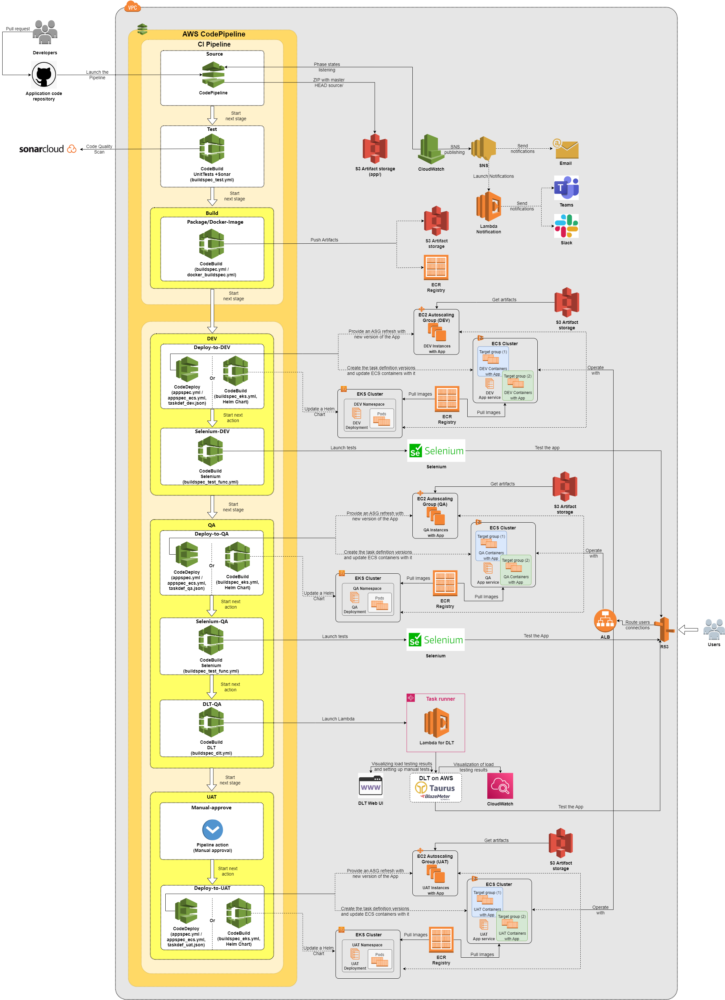

<h1 align="center"> CI/CD pipeline on native AWS services </h1>

* [Continuous Integration](./cicd.md#continuous-Integration)
* [Continuous Delivery](./cicd.md#continuous-Delivery)
  * [DEV stage](./cicd.md#dEV-stage)
  * [QA stage](./cicd.md#qA-stage)
  * [UAT stage](./cicd.md#uAT-stage)
* [Further reading](./cicd.md#further-reading)

Continuous Integration flow is implemented using the following:
* `CodePipeline`, as a tool for following the applied code changes.
* `CodeBuild`, as a managed continuous integration service that compiles source code, runs tests, and produces software packages/containers.

Continuous Delivery flow is implemented using the following:
* `CodePipeline`, as a tool for constant application of code changes
* `CodeDeploy`, for Application deploying
* `CodeBuild` for update Application in EKS Cluster

At the moment `Bitbucket`, `CodeCommit`, `GitHub` and `GitLab` can be used as code hosting and collaboration platforms.

<h4 align="center"> CI/CD pipeline concept </h4>

 

## Continuous Integration

`CodePipeline` is configured to automatically start the CI/CD pipeline when a change occurs in the source code in the branch that you specified. CI Pipeline has the following actions defined:
1.	`Source` - when change is detected, `CodePipeline` creates a ZIP archive with current HEAD snapshot of the main branch and uploads it into the artifact storage S3 bucket (`source/` prefix).
2.	`Test` - performs code quality checks with `SonarCloud` and unit testing, then uploads test results into artifact storage `S3` bucket (`tested/` prefix). It needs to be configured in the [buildspec_test.yml](./template_config_files/buildspec_test.yml) file in the application repository.
3.	`Build` (`Package`/`Docker-Image`) - uses a custom [script](../modules/buckets_for_accelerator/storage_bucket_files/pack_to_deb.sh) that is uploaded to the `S3` bucket. It supports `Java builds jar`, `Golang go extensions`, or `Python source` and required files and packs it into deb package, then uploads package into artifact storage `S3` bucket (`packaged/` prefix). It is configured [buildspec.yml](./template_config_files/buildspec.yml) for EC2 deployment and in [docker_buildspec.yml](./template_config_files/docker_buildspec.yml) for ECS deployment in the application repo. Part of the CI pipeline works according to the following algorithm: The application code is piped to the artifact repository, checked for quality with `SonarCloud`, and packaged for the next installation in a Debian package or in a container. Each time the Build stage is completed successfully, the first stage of the CD pipeline starts. The CD pipeline consists of three logical blocks, described in the respective sections below.

## Continuous Delivery
### DEV stage

1.	The `Deploy-to-DEV` action starts after receiving a signal about the start of a stage. It launches the container with `CodeDeploy` to deploy the Application on the `EC2 instance` from the `deb package`, or to `ECS Service` with a new Docker Image. It is configured in [appspec.yml](./template_config_files/appspec.yml) or [appspec_ecs.yml](./template_config_files/appspec_ecs.yml) from the application repo.
2.	The `Selenium-DEV` action is doing functional tests using `Selenium`. This works as a quality gate for the next stage. It is configured in [buildspec_test_func.yml](./template_config_files/buildspec_test_func.yml) from application repo. Testing parameters are passed in the following variables:
 *	 `APP_TARGET_URL` - defines application endpoint to test
 *	 `PASS_RATE` - defines a threshold percent, based on which test can be considered as passed. When the pass rate condition is not met, the `CodeBuild job` fails. Suppose all tests are completed with acceptable results. In that case, the next step is to initiate an update with the new version of the Application inside the instances in the QA-ASG target group or a new task with the new Docker container in the QA service.

### QA stage

1.	The `Deploy-to-QA` action starts after receiving a signal about the start of a stage. It launches a container with the `CodeDeploy` to deploy the Application on the EC2 instance from the deb package or to `ECS Service` with a new Docker Image. It is configured in [appspec.yml](./template_config_files/appspec.yml) or [appspec_ecs.yml](./template_config_files/appspec_ecs.yml) from the application repo.
2.	The `Selenium-QA` action is doing functional tests using `Selenium`. This works as a quality gate for the next stage. It is configured in [buildspec_test_func.yml](./template_config_files/buildspec_test_func.yml) from the application repo. Testing parameters are passed in the following variables:
 *	 `APP_TARGET_URL` - defines application endpoint to test
 *	 `PASS_RATE` - defines a threshold percent, based on which test can be considered as passed. When pass rate condition is not met, the `CodeBuild` job fails.
3.  The `DLT-QA` action runs a performance test

* The AWS's [Load Testing Solution](https://docs.aws.amazon.com/solutions/latest/distributed-load-testing-on-aws/welcome.html) has been implemented.
* We modified the CloudFormation stack file [dlt.yml](../features/storage_bucket/dlt.yml) for our needs to integrate it into AWS CodePipeline.
* CloudFormation Stack is deployed automatically upon creating the `CodePipeline` project resources.

Other configuration files will be used when the application pipeline stage starts:
* `CodeBuild` buildspec file [buildspec_dlt.yml](../docs/template_config_files/buildspec_dlt.yml). 
* Application-specific scripts: 

   [dlt_test.json](./template_config_files/scripts/dlt/dlt_test.json) consists of json code for `jmeter`

   [dlt_test.py](./template_config_files/scripts/dlt/dlt_test.py) 
* For more information follow this [link](../docs/dlt.md).

Testing parameters are passed in the following variables:   
 *  `EXPECT_SUCCESS_RATE` - defines a threshold percent of passed tests, based on which test can be considered as passed. When the pass rate condition is not met, the CodeBuild job fails
 *  `SUCCESS_P95` - defines the 95th percentile response rate threshold, in seconds, at which the test can be considered a pass. When the pass rate condition is not met, the `CodeBuild job` fails. If all steps are completed successfully, this acts as a quality checkpoint before the manual approval action.

### UAT stage

1.	When the user approves the deployment manually.
2.	The `CodeBuild` from `Manual-Approve` action starts after receiving a signal about the start of the stage, it starts/aborts the next action.
3.	The `Deploy-to-UAT` action starts after receiving a signal about the manual approval. It launches a container with `CodeDeploy` to deploy the Application on the EC2 instance from the deb package or to `ECS Service` with a new Docker Image. It is configured in [appspec.yml](./template_config_files/appspec.yml) or [appspec_ecs.yml](./template_config_files/appspec_ecs.yml) from the application repo. The app is ready for production use.

### Deploy to Kubernetes Cluster
* We use AWS Codebuild on each stage to update Helm chart. 
* You need to put [buildspec_eks.yml](../docs/template_config_files/buildspec_eks.yml) in the root of the application repository and [folder kubernetes](..docs/template_config_files/scripts/kubernetes/) to the scripts folder.
* In the [application_vars.yml](../terragrunt_way/applications/example_application/application_vars.yml) define `target_type = "eks" or "kube_cluster"`
* Depending on the cluster define all variables accordingly.
* *Important notice:* `buildspec_eks.yml` file is filled depending on Helm Chart and type of the Cluster.
#### Working with Kubernetes Cluster
* To get all variables from a cluster administrator needed for Helm Chart
* To get access to Helm Repository, in our example we store Helm Chart on AWS S3 Bucket
* To get access to the control plane the cluster(to give permissions AWS Codebuild Role or get `user kubeconfig` of the cluster with right permissions) 
* To add variables to AWS Codebuild in terraform code
* To add sensitive variables to the AWS Parameter Store

## Further reading

* [Application environments](../docs/app-envs.md)
* [Notifications](../docs/notifications.md)
* [Pull Request Analysis](../docs/PRanalysis.md)
