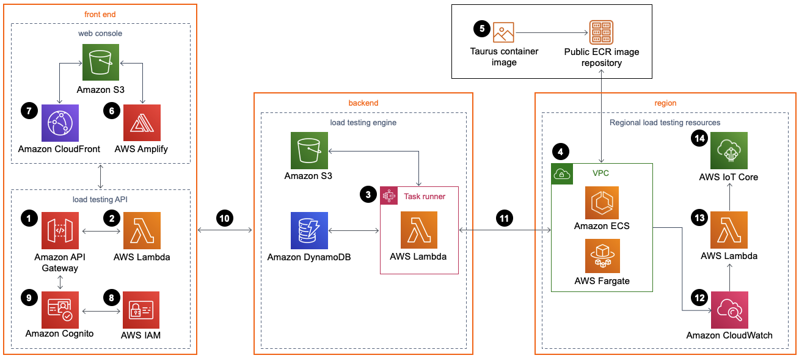
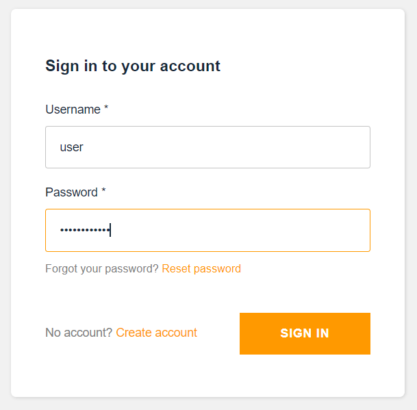
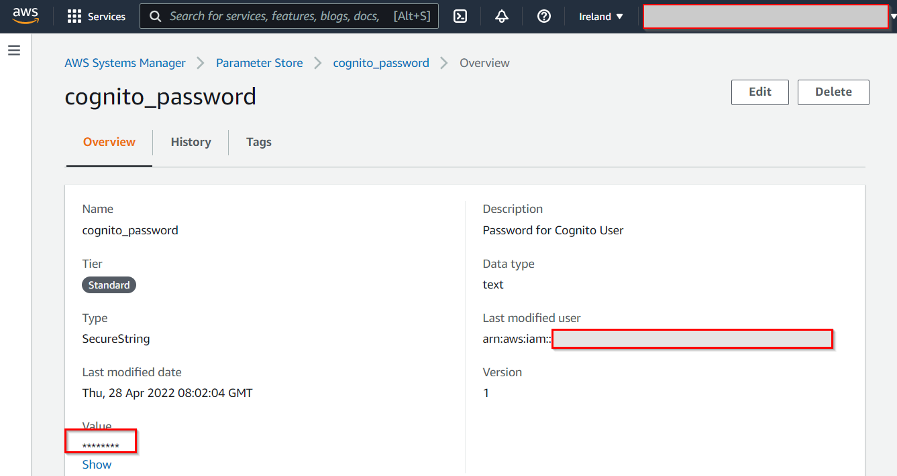
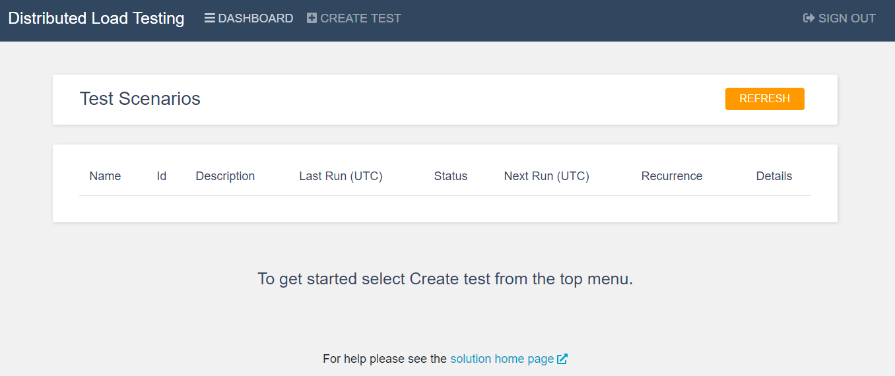
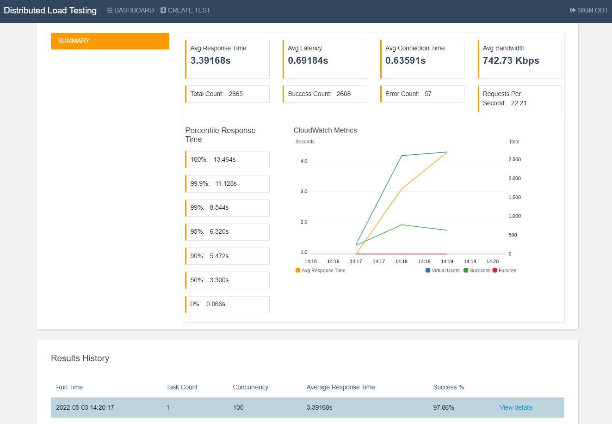

<h1 align="center">  Distributed Load Testing on AWS provisioning </h1>

* [Architecture overview](./dlt.md#architecture-overview)
* [DLT deployment](./dlt.md#dLT-deployment)

## Architecture overview
Deploying this solution with the default parameters builds the following environment in the AWS Cloud.

Distributed Load Testing on AWS architecture
      

The AWS CloudFormation template deploys the following resources:

1. An [Amazon API Gateway](https://aws.amazon.com/api-gateway) API to invoke the solution's microservices ([AWS Lambda](https://aws.amazon.com/lambda) functions).
2. The microservices provide the business logic to manage test data and run the tests.
3. These microservices interact with [Amazon Simple Storage Service](https://aws.amazon.com/s3) (Amazon S3), [Amazon DynamoDB](https://aws.amazon.com/dynamodb), and [AWS Step Functions](https://aws.amazon.com/step-functions) to run test scenarios and provide storage for the test scenario details and run test scenarios.
4. An [Amazon Virtual Private Cloud](https://aws.amazon.com/vpc) (Amazon VPC) network topology contains the solution's [Amazon Elastic Container Service](https://aws.amazon.com/ecs)(Amazon ECS) containers running on [AWS Fargate](https://aws.amazon.com/fargate).
5. The containers include a [Taurus](https://gettaurus.org/) load testing [Open Container Initiative](https://opencontainers.org/) (OCI) compliant container image which is used to generate load for testing your application’s performance. Taurus is an open-source test automation framework. The container image is hosted by AWS in an [Amazon Elastic Container Registry](https://aws.amazon.com/ecr)(Amazon ECR) public repository.
6. A web console powered by [AWS Amplify](https://aws.amazon.com/amplify) is deployed into an Amazon S3 bucket configured for static web hosting.
7. [Amazon CloudFront](https://aws.amazon.com/cloudfront) provides secure, public access to the solution’s website bucket contents
8. During initial configuration, the solution also creates a default solution administrator role and sends an access invite to a customer-specified user email address.
9. An [Amazon Cognito](https://aws.amazon.com/cognito) user pool manages user access to the console and the Amazon API Gateway API.
10. After you deploy this solution, you can use the web console to create a test scenario that defines of a series of tasks.
11. The microservices use this test scenario to run Amazon ECS on AWS Fargate tasks in the AWS Regions specified.
12. In addition to storing the results in Amazon S3 and DynamoDB, once the test is complete the output is logged in [Amazon CloudWatch](https://aws.amazon.com/cloudwatch).
13. If you select the live data option, the solution sends the Amazon CloudWatch logs for the AWS Fargate tasks to a Lambda function during the test, for each Region in which the test was run.
14. The Lambda function then publishes the data to the corresponding topic in [AWS IoT Core](https://aws.amazon.com/iot-core) in the Region where the main stack was deployed. The web console subscribes to the topic, and you can see the data while the test runs in the web console.

More information can be found at the [link](https://docs.aws.amazon.com/solutions/latest/distributed-load-testing-on-aws/welcome.html).

## DLT deployment
`DLT` runs in containers using AWS ECS Fargate.  
The flow looks like this:  
1. The CloudFormation dlt.yml stack file for the "Distributed Load Testing on AWS" deployment is located in the <Project name>-storage-bucket-<region> segment and is used by Terraform to deploy the required infrastructure using CloudFormation.
2. Tests in the Distributed Load Testing infrastructure deployed in the initial deployment phase of the configuration will be configured by the user and run by the pipeline based on the following  configuration files:
  * CodeBuild's buildspec file [buildspec_dlt.yml](../docs/template_config_files/buildspec_dlt.yml). To satisfy your conditions, you need to change the parameter values (EXPECT_SUCCESS_RATE, SUCCESS_P95). First, it is the desired percentage of the successful passage of quality gates. The second is the preferred test time for the 95th percentile.
  * Application-specific scripts ([dlt_test.json](../docs/template_config_files/scripts/dlt/dlt_test.json), [dlt_test.py](../docs/template_config_files/scripts/dlt/dlt_test.py)). You can also change the test script in [dlt_test.json](../docs/template_config_files/scripts/dlt/dlt_test.json). More information can be found at the [link](https://docs.aws.amazon.com/solutions/latest/distributed-load-testing-on-aws/source-code.html).
3. After the DLT infrastructure is created, you receive the email specified in the configuration when the infrastructure was raised. It contains a link to the console, username and initial password required for initial login and password change.
  
  
  
  Now you must change the password to a new one, which should be the same as the one in the Parameter Store (cognito_ password) you created earlier.
  
  
  
  After that, you will be taken to the console.
  
  
  
4. As soon as the pipeline runs CodeBuild in the DLT-QA stage, you will see the test result. You can also find a link to the console at the end of the CodeBuild log.

  