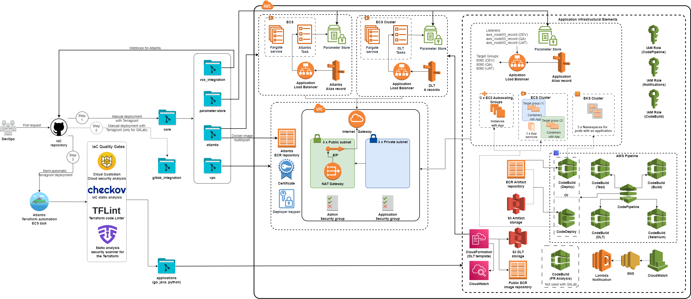

<h1 align="center"> Infrastructure deployment </h1>



### There are two steps of infrastructure deployment:
* [Manual](./infra.md#manual)
* [Semi-automatic](./infra.md#semi-automatic)
## Manual 
#### Managed by the user using CLI tools (`AWS CLI`, `Docker`, `Terraform`, and `Terragrunt` need to be installed)
#### This step deploys terraform modules:
- `vpc`,
- `atlantis`, 
- `parameter-store`,
- `vcs_integration`

#### Terragrunt implementation:
* The root directory when we use `Terragrunt` is [terragrunt_way](../terragrunt_way/).
* The file [terragrunt_way/terragrunt.hcl](../terragrunt_way/terragrunt.hcl) in the root directory defines *Terraform Backend*. The bucket name for the Backend is specified in `terragrunt_way/common_vars.yml`
* The Terragrunt configuration is defined in the `terragrunt.hcl` file in each working directory involved in the deployment.
* Common variables for modules are defined in the [terragrunt_way/common_vars.yml](./variables.md#Common) 
* Sensitive variables are defined in the `terragrunt_way/parameter_store.yml`, which we have to create from [parameter_store_example.yml](variables.md#sensitive)
* Also, you can find the description of the variables [here](./variables.md)
#### *1. Core resources* [terragrunt_way/core](../terragrunt_way/core) should be deployed once: 
a) Fill in all variables in the `terragrunt_way/common_vars.yml` file.

b) Move [parameter_store_example.yml](../terragrunt_way/parameter_store_example.yml) to the `terragrunt_way/parameter_store.yml` file and fill in all variables you need. **Don't push this file to the repository. This file should include in `.gitignore`!!!**

c) Deploy infrastructure:
```bash
infra $ cd terragrunt_way/core
core $ terragrunt run-all apply
``` 
#### *2. Additional step* `GitLab Integration`, if you use GitLab for application hosting:
a) Because of the lack of communication between GitLab and AWS, you need to create mirroring from GitLab to AWS CodeCommit. We create an AWS CodeCommit repository and use the GitLab CI/CD to mirror the application code from GitLab to AWS CodeCommit. We also use this GitLab CI/CD in our PR analysis process. 

b) Since we use AWS CodeCommit as a mirror, we need to use a prepared SonarCloud Project to test the application code. Such as this [example](https://harshanas.medium.com/integrate-sonarcloud-with-aws-codecommit-and-codebuild-186ad80a109).

c) Copy [terragrunt_way/gitlab_integration/example](variables.md#Integration) to `terragrunt_way/gitlab_integration/your_app_name`.

d) Change the name of `gitlab_example.tfvars` to `gitlab.tfvars`. **Don't push this file to the repository. This file must be included in `.gitignore`**.

e) Fill in all variables in `gitlab.tfvars`.

f) Deploy integration:
```bash
infra $ cd terragrunt_way/gitlab_integration/your_app_name
your_app $ terragrunt apply
```
g) Put [.gitlab-ci.yml](../docs/template_config_files/.gitlab-ci.yml) to the root of your GitLab repository for application. It will start GitLab CI/CD Pipeline to mirror the GitLab repo to AWS CodeCommit.


## Semi-automatic

* You need to specify the branch into which the code will be merged to deploy the infrastructure in the [atlantis.yml](../atlantis.yaml) file. 
```
workflows:
#==================== Terragrunt Workflow ==========================#
  terragrunt:
    plan:
      steps:
        - env:
            name: BASE_BRANCH_NAME
            value: <your_main_branch>
```
* After you push it to the repository, Atlantis will execute the specified workflow.

### Application resources:

1. Copy the template folder [example_application](../terragrunt_way/applications/example_application) into the same folder `../terragrunt_way/applications` and rename it.
2. Add this folder `terragrunt_way/applications/your_app` to [atlantis.yml](../atlantis.yaml)
```
- dir: terragrunt_way/applications/your_app
  workflow: terragrunt
  autoplan:
    when_modified: [ "../../../modules/**/*.tf", "../../common_vars.yml", "application_vars.yml", "terragrunt.hcl" ]
    enabled: true
```
3. Define all variables in [application_vars.yml](variables.md#Application) in your application folder.
4. Push to the repository.
5. If you have application variables to be placed in the Parameter Store, do the following:
   * Copy [parameter_store_application](../docs/template_config_files/parameter_store_application) folder to the [parameter_store_apps](../terragrunt_way/core/parameter_store_apps) folder;
   * Put all variables you need into `../terragrunt_way/core/parameter_store_apps/parameter_store.yml` file;
   * Make `apply`:
   ```bash
   infra $ cd core/parameter_store_apps/<your apps>
   <your apps> $ terragrunt apply
   ```


### Atlantis flow:

Currently, the following flow, described in [atlantis.yaml](../atlantis.yaml), is used:
1. `Atlantis` **plan** run is triggered automatically by raising pull request into branch you specified and includes the following steps:
    * `terragrunt validate`
    * `terragrunt plan -out $PLANFILE $DESTROY_PARAMETER`
    * testing Terraform code with `Checkov`, `TFSec` or `Regula`
    * runs `Infracost` to estimate the cost of the planned infrastructure
    * **to destroy infrastructure** is used `$DESTROY_PARAMETER` and command `atlantis plan -d path/to/directory -- -destroy`
2. If there are no errors in the previous step, the following steps:
    * comment `atlantis apply -d path/to/directory` in PR and `Atlantis` will **apply** changes in PR to the existing infrastructure
    * testing AWS infrastructure with `Cloud Custodian` with rules described in [custodian.yml](../custodian.yml) or runs [custodian.sh](../custodian.sh) if we use EPAM Custodian
3. If changes are applied successfully, PR is **merged** to the branch being specified.

**TODO**: Current implementation allows repos to define their own workflows. It means that anyone can create a pull request to the repo and essentially run arbitrary code on the `Atlantis` server. To prevent that:
* [custom workflow code](../atlantis.yaml) must be moved to the [Atlantis Server Side Repo Config](../modules/atlantis/repos.yaml)
* `allow_custom_workflows` must be disabled.

**TODO**: `Cloud Custodian` currently has just one stub rule to demonstrate usage feasibility.


## Further reading

* [CI/CD](../docs/cicd.md)
* [Application environments](../docs/app-envs.md)
* [Supported Linters and Static Code Analysis tools for Terraform](../docs/linters.md)