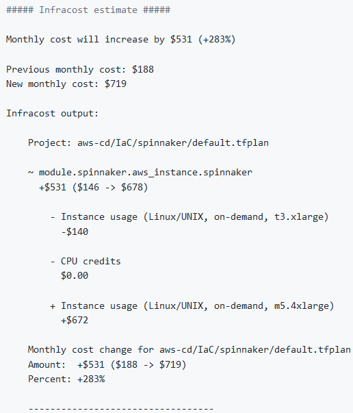
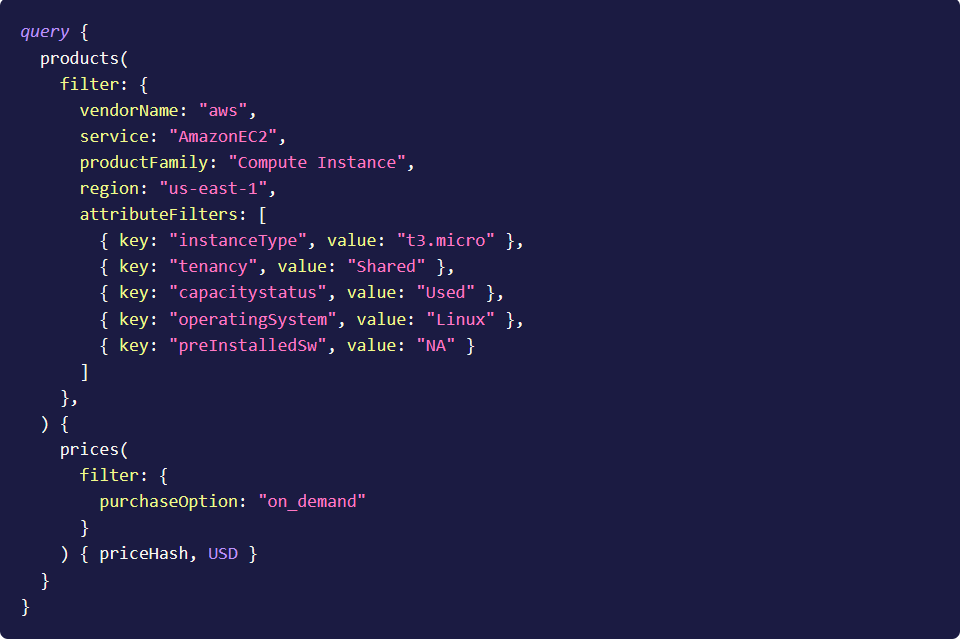

<h1 align="center">  Supported Linters and Static Code Analysis tools for Terraform </h1> 

* [Infracost](./linters.md#infracost)
* [TFSec](./linters.md#tFSec)

<hr>

Currently, we support the following:
 * [Checkov](https://www.checkov.io/), a tool for scanning cloud infrastructure configuration misconfigurations.
 * [Regula](https://regula.dev/), a tool for scanning cloud infrastructure configuration misconfigurations.
 * [Cloud Custodian](https://cloudcustodian.io/), a rules engine for managing public cloud accounts and resources, it is needed to write your own policies in [custodian.yml](../custodian.yml) file.
 * [tfsec](https://tfsec.dev/), a static analysis security scanner for Terraform code.
 * [Infracost](https://www.infracost.io/), a cloud cost estimation tool for Terraform in pull requests.

In order to use a specific linter, you have to set the environmental variable of the linter to `1` in the [Atlantis workflow](../atlantis.yaml). If you don't want to use some linters, specify its environmental variable to `0`.
<hr>

## Infracost 

To use `Infracost`, an API key must be generated. To do that, you need to:
```
$ curl -fsSL https://raw.githubusercontent.com/infracost/infracost/master/scripts/install.sh | sh
$ infracost register
```
The key is saved in `./atlantis.yaml`.

To calculate the estimated costs of your infrastructure, Infracost sends [data](https://www.infracost.io/docs/faq#what-data-is-sent-to-the-cloud-pricing-api) to the server where data is processed. 

If `Infracost` was run initially, it would show the entire infrastructure's estimated cost. Consecutive runs will show only the *DELTA*.

**Example output:**

 

**Example request:**



If you don't want this to happen, either the tool can be disabled, or you can run your own [Cloud Pricing API](https://www.infracost.io/docs/faq#can-i-run-my-own-cloud-pricing-api).

## TFSec

Useful flags that can help with modifying the command according to your infrastructure needs:
```
$ tfsec --exclude <rule_name> -> to exclude false positives
$ tfsec --soft-fail -> security-related issues will not impact the exit status code of the command
$ tfsec --concise-output -> will only print out security misconfiguration without additional statistics
```
All these tools are integrated into [atlantis](../atlantis.yaml) workflow