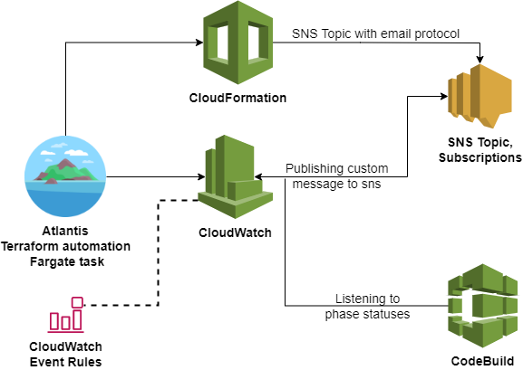
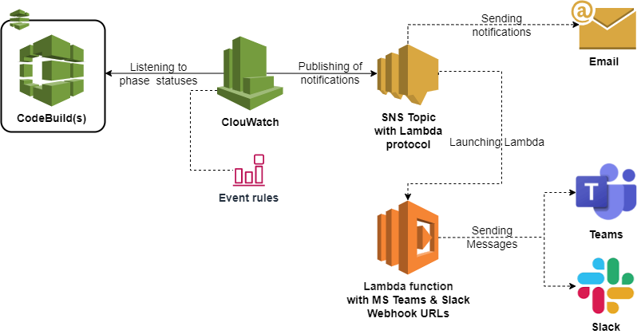

<h1 align="center"> Notifications </h1>

* [Email](./notifications.md#Email)
* [Microsoft Teams and Slack](./notifications.md#microsoft-Teams-and-Slack)

Supporting Email Microsoft Teams and Slack notifications from CodeBuild/CodePipeline.

## Email 

Email notifications are implemented using the following:
* `Terraform` for deployment SNS topic with email subscriptions
* `CloudWatch events` to monitor CodeBuild phase statuses

Atlantis(Terraform) is used to create SNS topics from [email.tf](../modules/accelerator/notifications/email.tf)
and `CloudWatch Event rules` for *successful* and *failed* CodeBuild builds/CodePipeline.

`CloudWatch` will listen to *CodeBuild* phase statuses. 

Failed: 
* TIMED_OUT
* STOPPED
* FAILED
* FAULT
* CLIENT_ERROR

Successful:
* SUCCEEDED

Once `CloudWatch` notices one of these statuses, it will craft and publish the notification with a custom message
to the SNS topic.

## Microsoft Teams and Slack

Microsoft Teams and Slack implementation uses:
* `CloudWatch Event` rules
* `SNS Topic` using Lambda protocol
* `Lambda` function
* `MS Teams` web-hook
* `Slack` web-hook

Resources: SNS topic with Lambda protocol and Lambda function will be created using Atlantis(Terraform). 

At this point, the same `CloudWatch` Event rules will be used: *successful* and *failed* builds. In addition,the [Lambda function](../modules/accelerator/notifications/notification_lambda.py), that is written in Python, will accept a Webhook.

`CloudWatch` will listen to *CodeBuild* phase statuses. 

Failed: 
* TIMED_OUT
* STOPPED
* FAILED
* FAULT
* CLIENT_ERROR

Successful:
* SUCCEEDED

Once `CloudWatch` publishes a notification to `SNS` Topic, the `Lambda` function will be triggered and custom message
will be sent to the Web-hook URL that was passed to the function itself.
